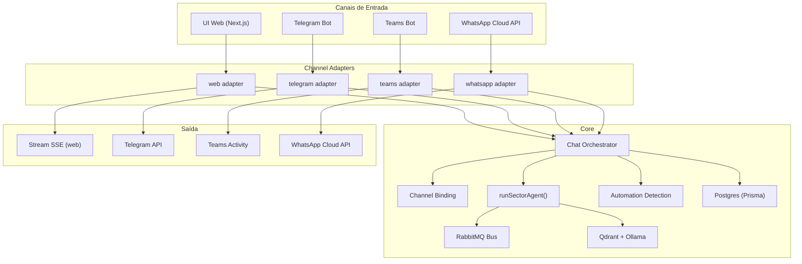

# Estratégia Multi-Canal para o pfrm-secure-agents

Este documento descreve as alterações necessárias para que os agentes setoriais
(Forja, Sentinela, Helpdesk) possam ser acionados por **múltiplos canais de
comunicação** — Microsoft Teams, Telegram, WhatsApp — além da interface web
atual, comportando-se como um colaborador real que atende por qualquer meio.

## 1. Diagnóstico da arquitetura atual

### O que temos hoje

```
Usuário → UI Next.js (React) → app/api/chat/route.ts → runSectorAgent()
                                        ↓
                              ┌─────────────────────┐
                              │  Camada de domínio   │
                              │  lib/agents/         │
                              │  lib/bus/            │
                              │  lib/db/             │
                              │  lib/ollama.ts       │
                              │  lib/qdrant.ts       │
                              └─────────────────────┘
```

### Acoplamentos identificados que impedem multi-canal

| Ponto de acoplamento | Arquivo | Problema |
| --- | --- | --- |
| Autenticação via Auth.js/Cookies | `auth.ts`, `app/api/chat/route.ts` | A sessão vem de cookie HTTP via `auth()`. Canais externos (bot Teams, webhook Telegram) não têm cookie de sessão. |
| Lógica de negócio dentro da rota HTTP | `app/api/chat/route.ts` (622 linhas) | Toda a orquestração — detectar automação, resolver aprovação, acionar `runSectorAgent`, stream SSE, persistir mensagens — está misturada dentro do handler HTTP. Um bot de Telegram não pode reutilizar esse fluxo. |
| Resposta como stream SSE | `app/api/chat/route.ts` L309-612 | O `ReadableStream` com `text/event-stream` é específico da UI web. Cada canal tem seu próprio protocolo de entrega (Telegram API, Teams Activity, WhatsApp Cloud API). |
| Sessão com userId direto do JWT | `app/api/chat/route.ts` L253-256 | O `session.user` carrega `id`, `email`, `sector`, `role` vindos do JWT. Canais externos precisam de um mapeamento entre identidade do canal e usuário no sistema. |
| Conversa atrelada a userId | `lib/db/conversations-repo.ts` | `findConversationForUser` filtra por `userId`. Um bot precisa resolver o userId a partir de um identificador externo (chatId do Telegram, UPN do Teams, phoneNumber do WhatsApp). |
| Schema sem campo de canal de origem | `prisma/schema.prisma` | Não existe `channel` em `Message` ou `Conversation`. Sem isso, não há como distinguir se a mensagem veio do web, Teams, Telegram ou WhatsApp. |

---

## 2. Arquitetura proposta: Camada de Mediação (Channel Gateway)

A ideia central é **extrair a lógica de orquestração** da rota HTTP e criar uma
camada agnóstica de canal entre os adaptadores de entrada e o domínio.

```
                ┌────────────┐ ┌──────────┐ ┌───────────┐ ┌──────────┐
                │  UI Web    │ │ Telegram │ │   Teams   │ │ WhatsApp │
                │  (Next.js) │ │   Bot    │ │    Bot    │ │  Cloud   │
                └─────┬──────┘ └────┬─────┘ └─────┬─────┘ └────┬─────┘
                      │             │             │             │
                      ▼             ▼             ▼             ▼
              ┌──────────────────────────────────────────────────────┐
              │            Channel Adapters (lib/channels/)          │
              │  web.ts  │  telegram.ts  │  teams.ts  │ whatsapp.ts │
              └──────────────────────┬──────────────────────────────┘
                                     │
                           CanonicalMessage
                                     │
                                     ▼
              ┌──────────────────────────────────────────────────────┐
              │            Chat Orchestrator (lib/orchestrator.ts)   │
              │                                                      │
              │  • Resolver identidade do canal → userId             │
              │  • Detectar intent de automação                      │
              │  • Gerenciar fluxo de aprovação                      │
              │  • Chamar runSectorAgent()                           │
              │  • Persistir mensagens                               │
              │  • Publicar auditoria                                │
              │  • Retornar resposta agnóstica                       │
              └──────────────────────┬──────────────────────────────┘
                                     │
                                     ▼
              ┌──────────────────────────────────────────────────────┐
              │            Domínio (sem mudanças)                    │
              │  lib/agents/ │ lib/bus/ │ lib/db/ │ lib/ollama.ts   │
              └─────────────────────────────────────────────────────┘
```

---

## 3. Mudanças necessárias — detalhamento por área

### 3.1. Nova camada: Chat Orchestrator

**O que é**: Uma função `processMessage()` pura, sem dependência de HTTP, que
recebe uma mensagem canônica e devolve uma resposta canônica.

**Arquivo proposto**: `lib/orchestrator.ts`

**Contrato de entrada (CanonicalMessage)**:

```typescript
type CanonicalMessage = {
  channelId: string;             // ex: "web", "telegram", "teams", "whatsapp"
  externalUserId: string;        // id nativo do canal (chatId, UPN, phone)
  externalConversationId?: string; // thread ou chat group do canal
  text: string;                  // conteúdo da mensagem
  attachments?: Attachment[];    // futuramente: docs para ingestão via canal
};
```

**Contrato de saída (CanonicalResponse)**:

```typescript
type CanonicalResponse = {
  conversationId: string;
  messageId: string;
  traceId: string;
  answer: string;                // resposta completa (não incremental)
  citations: ChatCitation[];
  delegationTrace?: DelegationTrace[];
  automationResult?: HumanCaptchaAutomationLaunchResponse;
  metrics?: GenerationMetrics;
};
```

**Responsabilidade**: Extrair as ~370 linhas do bloco `start(controller)` de
`app/api/chat/route.ts` para dentro dessa função, substituindo `emit()` por
acumulação da resposta. O handler HTTP web continuaria usando stream SSE como
wrapper fino sobre o orchestrator.

---

### 3.2. Mapeamento de identidade: Vinculação Canal → Usuário

**Problema**: O Telegram identifica por `chatId`, o Teams por `userPrincipalName`,
o WhatsApp por `phoneNumber`. Nenhum desses existe no schema atual.

**Mudança no schema Prisma**:

```prisma
model ChannelBinding {
  id         String   @id @default(cuid())
  userId     String   @map("user_id")
  channel    String   // "telegram" | "teams" | "whatsapp"
  externalId String   @map("external_id") // chatId, UPN, phone
  verifiedAt DateTime? @map("verified_at")
  createdAt  DateTime @default(now()) @map("created_at")
  user       User     @relation(fields: [userId], references: [id], onDelete: Cascade)

  @@unique([channel, externalId])
  @@map("channel_bindings")
}
```

**Fluxo de vinculação**:

1. O admin registra o binding via painel `/admin/channels` (ou via seed).
2. Alternativamente, o usuário se autentica pelo canal enviando um token
   temporário gerado no web (self-service onboarding).
3. O orchestrator usa `findUserByChannelBinding(channel, externalId)` para
   resolver o `userId` e `sector`.

> [!IMPORTANT]
> Sem esse mapeamento, a regra de isolamento por setor não pode ser aplicada em
> canais externos. Este é o ponto mais crítico de segurança.

---

### 3.3. Schema: campo `channel` em Conversation e Message

**Motivo**: Para auditoria e para distinguir threads entre canais.

```prisma
model Conversation {
  // campos existentes...
  channel   String    @default("web")     // novo
}

model Message {
  // campos existentes...
  channel   String    @default("web")     // novo
}
```

---

### 3.4. Channel Adapters — um por plataforma

Cada adapter é um módulo que:

1. Recebe o evento nativo da plataforma (webhook HTTP ou SDK).
2. Converte para `CanonicalMessage`.
3. Chama `processMessage()`.
4. Converte `CanonicalResponse` no formato de resposta da plataforma.
5. Envia a resposta de volta ao canal.

#### 3.4.1. Telegram

| Item | Detalhe |
| --- | --- |
| SDK | `telegraf` ou `grammy` (Node.js) |
| Protocolo de entrada | Webhook HTTP (POST para `/api/channels/telegram/webhook`) |
| Identidade | `ctx.from.id` (número) |
| Entrega da resposta | `ctx.reply(answer)` ou `sendMessage` com markdown |
| Streaming | Não nativo. Usar "typing indicator" + mensagem completa, ou editar mensagem progressivamente via `editMessageText`. |
| Arquivos | `ctx.message.document` para ingestão futura |
| Limitação | Mensagens de até 4096 caracteres. Respostas longas precisam ser quebradas. |

**Arquivo proposto**: `lib/channels/telegram.ts`
**Rota de webhook**: `app/api/channels/telegram/webhook/route.ts`
**Env vars**:
```
TELEGRAM_BOT_TOKEN=...
TELEGRAM_WEBHOOK_SECRET=...
```

#### 3.4.2. Microsoft Teams

| Item | Detalhe |
| --- | --- |
| SDK | `botbuilder` (Microsoft Bot Framework SDK for Node.js) |
| Protocolo de entrada | Azure Bot Service → webhook HTTP (POST para `/api/channels/teams/messages`) |
| Identidade | `activity.from.aadObjectId` (Azure AD object ID) ou `activity.from.id` |
| Entrega da resposta | `context.sendActivity(answer)` com Adaptive Cards |
| Streaming | Usar `context.sendActivities()` com typing indicator + resposta final, ou streaming via `streamingResponse` do SDK v4.22+. |
| Autenticação extra | O bot precisa de Azure AD App Registration (`MICROSOFT_APP_ID`, `MICROSOFT_APP_PASSWORD`). |
| Limitação | Necessita publicação no Teams Admin Center ou sideloading para teste. |

**Arquivo proposto**: `lib/channels/teams.ts`
**Rota de webhook**: `app/api/channels/teams/messages/route.ts`
**Env vars**:
```
MICROSOFT_APP_ID=...
MICROSOFT_APP_PASSWORD=...
MICROSOFT_APP_TENANT_ID=...
```

#### 3.4.3. WhatsApp (Cloud API)

| Item | Detalhe |
| --- | --- |
| SDK | `whatsapp-web.js` (não-oficial, frágil) ou **WhatsApp Cloud API** (oficial, via Meta Business) |
| Protocolo de entrada | Webhook HTTP (POST para `/api/channels/whatsapp/webhook`) |
| Identidade | `entry.changes.value.contacts[0].wa_id` (número com DDI) |
| Entrega da resposta | `POST https://graph.facebook.com/v21.0/{phone-number-id}/messages` |
| Streaming | Não suportado. Enviar resposta completa. Para respostas longas, enviar em blocos sequenciais. |
| Autenticação extra | Meta Business Manager, WhatsApp Business Account, token permanente e verificação de webhook. |
| Limitação | Janela de 24h para mensagens não-template. Respostas devem ser enviadas dentro da janela de atendimento. |

**Arquivo proposto**: `lib/channels/whatsapp.ts`
**Rota de webhook**: `app/api/channels/whatsapp/webhook/route.ts`
**Env vars**:
```
WHATSAPP_VERIFY_TOKEN=...
WHATSAPP_ACCESS_TOKEN=...
WHATSAPP_PHONE_NUMBER_ID=...
```

---

### 3.5. Mudanças na rota de chat existente (web)

O `app/api/chat/route.ts` atual continuaria sendo o adapter do canal web, mas
com a lógica extraída:

```
app/api/chat/route.ts  (adapter web)
  → resolve sessão via auth()
  → monta CanonicalMessage com channelId="web"
  → chama processMessage()
  → converte resposta em stream SSE para o frontend
```

Isso reduz as 622 linhas do route.ts para ~80 linhas: apenas parsing de request,
sessão, stream e delegação ao orchestrator.

---

### 3.6. Mudanças na infraestrutura (Docker/Infra)

| Mudança | Detalhe |
| --- | --- |
| Novas env vars | Tokens e configurações de cada canal (ver seções acima) |
| Exposição HTTPS | Bots de Telegram e WhatsApp exigem HTTPS público para webhooks. Em produção, usar reverse proxy (nginx/Caddy) ou tunnel (ngrok/cloudflared) para dev local. |
| Adaptive Cards (Teams) | Pacote `adaptivecards-templating` se quiser cards visuais no Teams. |
| Rate limiting | Cada canal tem limites diferentes. Implementar fila de saída para evitar throttling. |

---

### 3.7. Novas dependências

| Pacote | Canal | Propósito |
| --- | --- | --- |
| `grammy` ou `telegraf` | Telegram | SDK do bot |
| `botbuilder` + `botframework-connector` | Teams | SDK do Bot Framework |
| Nenhum SDK extra (fetch puro) | WhatsApp | A Cloud API é REST puro |

---

## 4. Invariantes a preservar

Todas as regras atuais devem continuar valendo independente do canal:

- [x] **Isolamento de setor**: O usuário fala apenas com o agente do próprio
  setor. O canal não altera o setor — o setor vem do `User` vinculado.
- [x] **Delegação controlada**: Tráfego cross-sector só via RabbitMQ e
  protocolos explícitos.
- [x] **Aprovação de automação**: Outros setores não executam automação da Forja
  diretamente, mesmo via canal externo.
- [x] **Auditoria completa**: Todo evento deve registrar o `channel` de origem.
- [x] **Ingestão setorizada**: Se futuramente aceitar documentos via canal,
  continua gravando na coleção do setor autenticado.
- [x] **Idempotência**: Manter a chave de idempotência baseada no `messageId`
  do sistema, não no ID da mensagem do canal.

---

## 5. Riscos e decisões para o usuário

> [!WARNING]
> **Segurança de identidade**: Sem verificação forte do binding canal→usuário,
> qualquer pessoa com acesso ao chat do Telegram ou grupo do Teams poderia
> acionar automações. Recomenda-se fortemente um fluxo de verificação (token
> temporário) antes de aceitar mensagens de um canal novo.

> [!WARNING]
> **Streaming**: O canal web atual usa stream SSE, dando feedback em tempo real.
> Telegram e WhatsApp não suportam streaming nativo. A experiência será
> "mensagem completa depois de X segundos". Para mitigar, usar typing indicators
> e, no Telegram, editar a mensagem progressivamente.

> [!IMPORTANT]
> **Custos**: WhatsApp Cloud API cobra por conversa (janela de 24h). Teams
> requer Azure Bot Service (tier gratuito com limites). Telegram é gratuito.

> [!IMPORTANT]
> **Compliance**: Cada canal tem políticas de dados e LGPD próprias. Avaliar se
> o conteúdo dos agentes pode transitar por infraestrutura externa (Meta,
> Microsoft, Telegram LLC).

---

## 6. Ordem recomendada de implementação

### Fase 1 — Extração do Orchestrator (pré-requisito para qualquer canal)

1. Criar `lib/orchestrator.ts` com `processMessage()`.
2. Extrair lógica de `app/api/chat/route.ts` para o orchestrator.
3. Refatorar `app/api/chat/route.ts` para ser adapter fino sobre o orchestrator.
4. Validar que tudo continua funcionando com `npm test`, `npm run build`.

### Fase 2 — Schema e Binding

5. Adicionar `ChannelBinding` ao Prisma e migrar.
6. Adicionar campo `channel` em `Conversation` e `Message`.
7. Criar rota/admin para gestão de bindings.
8. Incluir `channel` nos eventos de auditoria.

### Fase 3 — Primeiro canal externo (Telegram — mais simples)

9. Instalar `grammy`.
10. Criar `lib/channels/telegram.ts`.
11. Criar `app/api/channels/telegram/webhook/route.ts`.
12. Implementar typing indicator + resposta completa.
13. Testar com BotFather + ngrok.

### Fase 4 — Teams

14. Registrar Azure Bot.
15. Instalar `botbuilder`.
16. Criar adapter e rota de webhook.
17. Testar com sideloading no Teams.

### Fase 5 — WhatsApp

18. Configurar WhatsApp Business Account no Meta.
19. Criar adapter usando fetch puro para Cloud API.
20. Criar rota de webhook com verificação de assinatura.

---

## 7. Estimativa de impacto por arquivo

| Arquivo | Tipo de mudança | Impacto |
| --- | --- | --- |
| `app/api/chat/route.ts` | Refatorar → adapter web | Alto (extrair ~400 linhas) |
| `lib/orchestrator.ts` | **NOVO** | Alto (centro da lógica) |
| `lib/channels/telegram.ts` | **NOVO** | Médio |
| `lib/channels/teams.ts` | **NOVO** | Médio |
| `lib/channels/whatsapp.ts` | **NOVO** | Médio |
| `app/api/channels/*/route.ts` | **NOVO** (3 rotas) | Baixo cada |
| `prisma/schema.prisma` | Adicionar ChannelBinding + campo channel | Médio |
| `lib/db/channel-bindings-repo.ts` | **NOVO** | Baixo |
| `lib/config.ts` | Adicionar env vars dos canais | Baixo |
| `docker-compose.yml` | Novas env vars | Baixo |
| `.env.example` | Documentar novas variáveis | Baixo |
| `lib/domain.ts` | Adicionar type `Channel` | Baixo |
| `lib/agents/base-agent.ts` | Sem mudança | Nenhum |
| `lib/agents/router.ts` | Sem mudança | Nenhum |
| `lib/agents/personas.ts` | Sem mudança | Nenhum |
| `lib/bus/publisher.ts` | Sem mudança | Nenhum |
| `lib/bus/consumer.ts` | Sem mudança | Nenhum |
| `lib/automation/` | Sem mudança | Nenhum |
| `lib/integrations/` | Sem mudança | Nenhum |
| `components/` | Sem mudança (UI web não muda) | Nenhum |

---

## 8. Diagrama completo da arquitetura multi-canal



---

## 9. Resumo executivo

A arquitetura atual tem **todo o domínio e regras de negócio bem estruturados**
em `lib/agents/`, `lib/bus/` e `lib/db/`. A principal barreira para multi-canal
é que a **orquestração está soldada dentro do handler HTTP** do Next.js. A
estratégia de menor risco é:

1. **Extrair** a orquestração para uma função pura (`lib/orchestrator.ts`).
2. **Adicionar** um mecanismo de vinculação canal→usuário (`ChannelBinding`).
3. **Criar adaptadores finos** por canal, que apenas convertem protocolo de
   entrada/saída e delegam ao orchestrator.

O domínio — agentes, delegação, RAG, automação, auditoria — **não precisa de
nenhuma alteração**. A mudança é arquitetural na camada de transporte, não na
camada de inteligência.

---

Última revisão: 2026-05-02.
