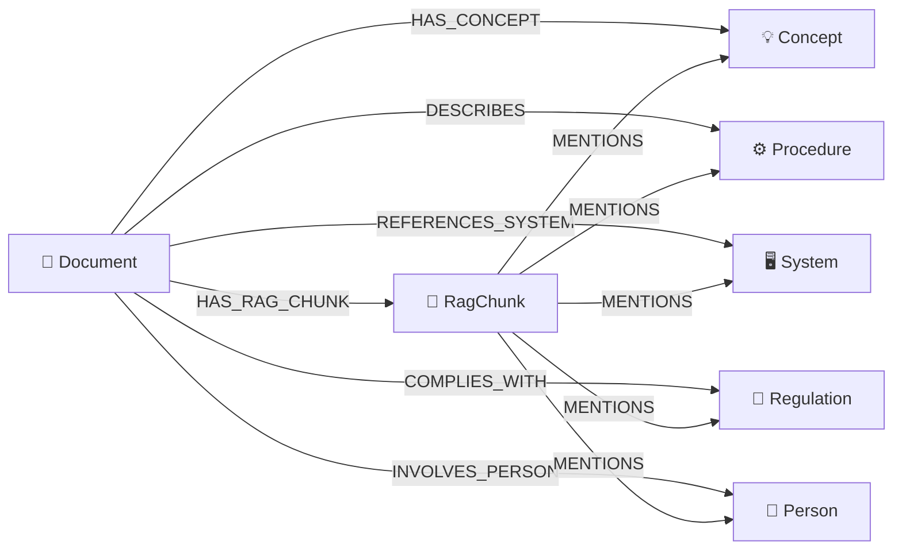
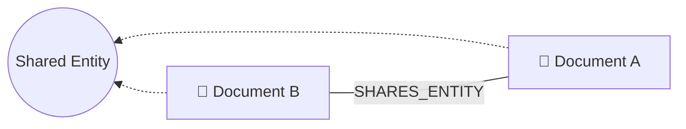
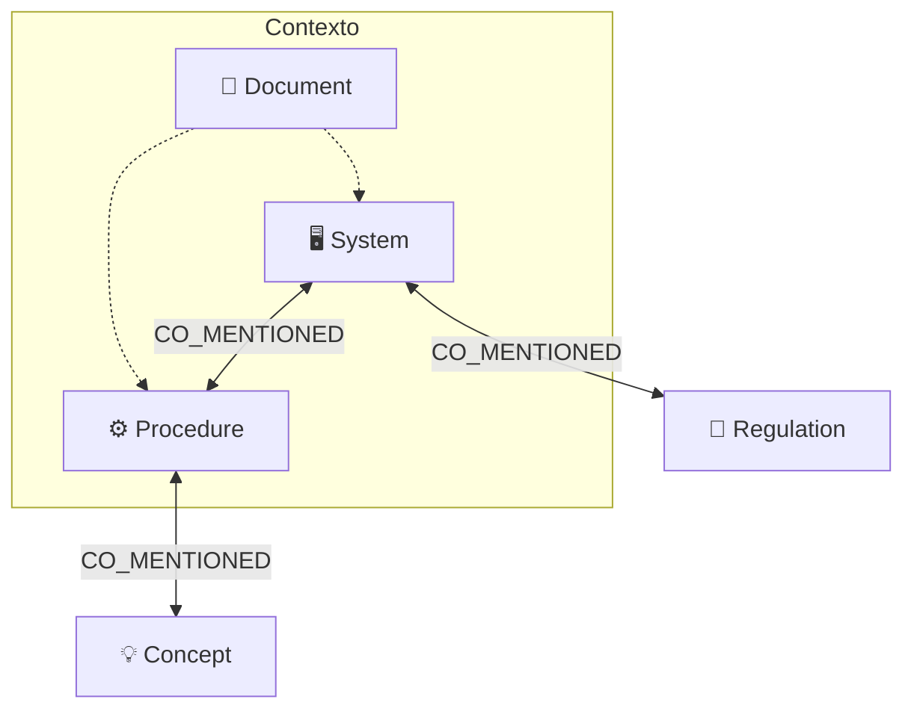
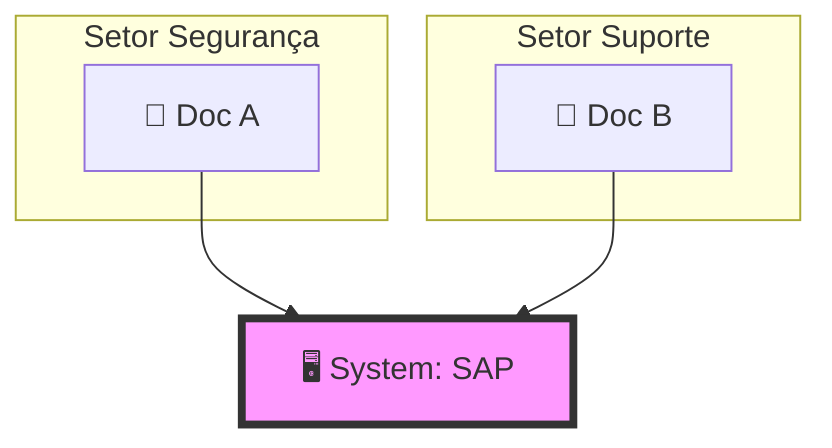

# Domínios e Relações no Neo4j (Knowledge Graph)

> Última revisão: 2026-05-20. As tabelas e diagramas abaixo refletem o estado atual do código em `lib/graph/persistence.ts` e `lib/graph/extractor.ts`. As "Oportunidades" em §4 foram revistas: alguns itens foram implementados desde a versão original deste documento e estão marcados como tal.

Este documento descreve a estrutura atual do banco de grafos (Neo4j), focando nos domínios existentes e suas interdependências, para apoiar a avaliação de novas áreas de integração.

## 1. Arquitetura de Nós (Labels)

O grafo é estruturado em torno de cinco domínios de entidade principais, mais o nó-hub `Document` e o nó técnico `RagChunk` que liga grafo e base vetorial:

| Nó | Tipo | Descrição | Exemplos |
|:--- |:--- |:--- |:--- |
| **Document** | hub | Representa um documento curado promovido (ou em processo). Carrega `id` (= `sourceDocumentId`, identidade estável), `sector`, `topic`, `documentType`, `status`, `title`. | `Manual de Acesso`, `SOP-Vendas-v1` |
| **Concept** | entidade | Conceitos técnicos ou termos-chave específicos de um setor ou negócio. | `Token JWT`, `Pedido Eletrônico`, `Churn Rate` |
| **Procedure** | entidade | Processos operacionais, passos ou fluxos descritos nos documentos. | `Reset de senha`, `Abertura de chamado`, `Ingestão de dados` |
| **System** | entidade | Ferramentas, plataformas, softwares ou APIs mencionadas. | `SAP`, `ServiceNow`, `Ollama`, `RabbitMQ` |
| **Regulation** | entidade | Normas, políticas, leis ou regulamentações que regem o conteúdo. | `LGPD`, `ISO 27001`, `Política de Senhas v2` |
| **Person** | entidade | Pessoas mencionadas no corpus (executor, aprovador, dono, autor). Extraídas por regex sobre padrões observados (e-mails corporativos, campos estruturados `Executor:` / `Aprovador:` / `owner:`, "Last updated by", etc.) porque o LLM `qwen3.5:4b` retornava lista vazia para o estilo do corpus. | `Carla Mendes`, `Henrique Andrade` |
| **RagChunk** | técnico | Reflete um ponto do Qdrant dentro do grafo, criando provenance bidirecional. Carrega `id` (`collection:pointId`), `pointId`, `collectionName`, `sector`, `documentId`, `sourceDocumentId`, `chunkIndex`, `headingPathText`, `contentHash`, `contentPreview`, `source`. | `rag_desenvolvimento:0a1f...` |

---

## 2. Relações Estruturais (Relacionamentos)

As conexões no grafo definem como o conhecimento está interligado:

### 2.1 Relações Persistidas (Físicas)
Estas são criadas durante o processo de extração (LLM + regex para Person) e gravadas no banco:

*   **Document** `[:HAS_CONCEPT]` -> **Concept**: O documento define ou explica este termo.
*   **Document** `[:DESCRIBES]` -> **Procedure**: O documento é o guia oficial para este processo.
*   **Document** `[:REFERENCES_SYSTEM]` -> **System**: O documento cita que este sistema é necessário ou utilizado.
*   **Document** `[:COMPLIES_WITH]` -> **Regulation**: O conteúdo do documento segue ou detalha o cumprimento desta norma.
*   **Document** `[:INVOLVES_PERSON]` -> **Person**: O documento atribui um papel (executor/aprovador/dono/autor) a essa pessoa.
*   **Document** `[:HAS_RAG_CHUNK]` -> **RagChunk**: O nó-hub liga o documento aos pontos vetoriais correspondentes no Qdrant.
*   **RagChunk** `[:MENTIONS]` -> **{Concept | Procedure | System | Regulation | Person}**: Indica que aquela entidade aparece literalmente no texto daquele chunk; usado também para popular `evidenceChunkIds` nas arestas `Document → Entity`, permitindo voltar do nó da entidade até o ponto exato do corpus que a citou.

### 2.2 Relações Computadas (Virtuais)
Calculadas em tempo real pelas APIs de visualização para revelar conexões indiretas:

#### Compartilhamento de Entidades
Revela quando documentos tratam dos mesmos temas.

#### Co-menção (Co-occurrence)
Sugere dependência funcional entre entidades de domínios diferentes.

*   **Document** `<->` **Document** (`SHARES_ENTITY`): Dois documentos que compartilham o mesmo conceito, sistema ou norma. Revela redundância ou complementaridade.
*   **Entity** `<->` **Entity** (`CO_MENTIONED`): Um Sistema e um Procedimento que aparecem juntos no mesmo documento. Sugere dependência funcional (ex: o Procedimento X usa o Sistema Y).

---

## 3. Dependências e Hierarquia

1.  **Hub de Ingestão**: O nó `Document` é o ponto de entrada. Sem ele, as entidades perdem o contexto de origem (setor, autoridade, data de extração).
2.  **Identidade estável**: `Document.id` é igual ao `sourceDocumentId` da curadoria (hash do conteúdo bruto original), não ao `documentId` interno do RAG. Isso preserva a identidade do documento mesmo quando a versão promovida muda (por exemplo, depois de responder uma lacuna operacional e reindexar).
3.  **Particionamento**:
    *   **Nós Document**: São particionados por `sector`, incluindo setores dinâmicos criados via `SectorDefinition`. A lista de setores válidos vem agora de `listAllSectors()`, não da constante `SECTORS` nativa.
    *   **Entidades**: São **globais**. Se o setor de "Segurança" e o de "Suporte" mencionam o sistema "SAP", ambos apontarão para o **mesmo** nó `System`. Isso permite a descoberta de conexões cross-sector.
    *   **Person**: também é global por padrão, mas há ferramenta `/admin/people-reclassify` para reescrever ocorrências de nome em entidades semânticas (Concept/Procedure/System/Regulation) e, opcionalmente, remover o nó Person quando ficar órfão.

3.  **Fluxo de Dados**: Extração (Ollama) -> Persistência (Neo4j) -> Enriquecimento (RAG).

---

## 4. Oportunidades de Novos Domínios

Para expandir a base de conhecimento da companhia, podem ser integrados os seguintes domínios. Status revisto em 2026-05-20:

| Novo Domínio | Motivação | Relação Sugerida | Status |
|:--- |:--- |:--- |:--- |
| **Role / Persona** | Mapear quem executa cada procedimento ou quem é o dono do sistema. | `(Role)-[:EXECUTES]->(Procedure)` | **Parcial.** `Person` foi adicionado como nó persistido em 2026-05-18 com `INVOLVES_PERSON` ligando ao `Document`. Falta papel formalizado: ainda não temos `Role` distinto de `Person`, nem aresta tipada `[:EXECUTES]` / `[:APPROVES]` / `[:OWNS]` distinguindo o tipo de envolvimento. O papel é hoje inferido pelo regex que extraiu o nome (`Executor:`, `Aprovador:`, `owner:`), mas não fica gravado na aresta. |
| **API / Endpoint** | Granularidade técnica para desenvolvedores além do nível de "Sistema". | `(System)-[:EXPOSES]->(API)` | **Não iniciado.** |
| **Business Rule** | Isolar regras de decisão de fluxos operacionais. | `(Procedure)-[:FOLLOWS]->(BusinessRule)` | **Não iniciado** como nó dedicado. As regras são hoje capturadas no JSON `knowledgeExtraction.rules[]` dentro de `CurationDocument`. |
| **Risk / Control** | Mapear riscos de segurança a sistemas e procedimentos específicos. | `(System)-[:HAS_RISK]->(Risk)` | **Não iniciado** como nó dedicado. Riscos ficam no JSON `knowledgeExtraction.risks[]`. |
| **Automation** | Identificar explicitamente se um processo já está automatizado ou é candidato. | `(Procedure)-[:AUTOMATED_BY]->(Automation)` | **Parcial.** O modelo relacional `AutomationCandidate` existe em Postgres (ligado a `CurationDocument` e opcionalmente a `ProcessMap`), com `automationLevel` (`none`/`assistida`/`parcial`/`total`), `automationLabel`, `suggestedScriptType`, `status` (`suggested`/`triaged`/`approved_for_design`/`implemented`/`rejected`) e `payload`. Não existe ainda como nó no grafo: a ponte `Procedure → AutomationCandidate` ainda é feita via consultas no Postgres em `lib/process-automation-map.ts`. |

### Arestas computadas (virtuais)

Já implementadas em runtime, **não** persistidas:

*   **CO_MENTIONED**: entidades de domínios diferentes que aparecem no mesmo documento; renderizada como aresta tracejada ciano em `/admin/knowledge-graph` e usada para sugerir dependência funcional (`Procedure` ↔ `System`, etc.). A última extração contou cerca de 8,5 mil arestas, incluindo ~1,6 mil pares Procedure-System.
*   **SHARES_ENTITY**: dois documentos que apontam para a mesma entidade; útil para detectar redundância/complementaridade.

---

**Nota Estrutural**: O Neo4j funciona de forma *Schema-less*. Novos domínios podem ser adicionados sem migrações de banco, apenas ajustando o prompt do extrator (`lib/graph/extractor.ts`), o persistidor (`lib/graph/persistence.ts`) e as interfaces de visualização (`components/graph-visualization.tsx`, `/admin/knowledge-graph`).

**Nota sobre setores dinâmicos**: o grafo participa do mecanismo de setores dinâmicos. A descoberta de documentos por setor em `/api/graph/documents` usa `listAllSectors()`, casa membros do grafo por `Document.id`, `sourceDocumentId` ou `legacyDocumentId`, e devolve metadata setor/agente para construção dos filtros de UI. Os payloads Qdrant agora carregam campos aditivos (`rag_collection`, `rag_point_id`, `rag_chunk_ref`, `graph_document_id`, `graph_source_document_id`, `graph_chunk_node_id`) que sustentam a navegação grafo ↔ vetor sem dados destrutivos para o histórico anterior.
