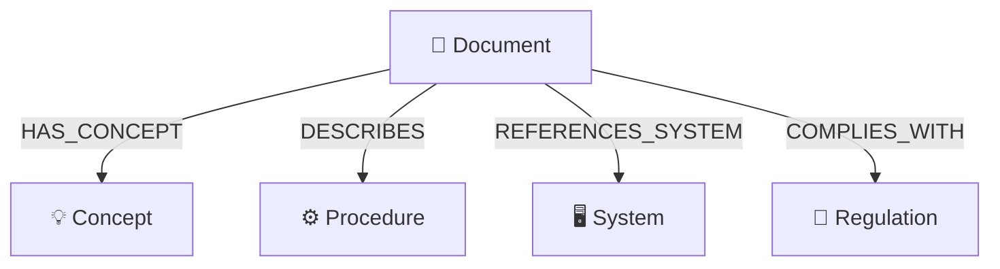

# Grafo de Conhecimento — Neo4j

Guia completo para desenvolvedores sobre o banco de grafos Neo4j integrado ao `pfrm-secure-agents`.

---

## 1. Por que um banco de grafos?

O projeto já possui dois bancos de dados:

| Banco | Tipo | Função |
|-------|------|--------|
| **PostgreSQL** (Prisma) | Relacional | Usuários, conversas, mensagens, curadoria, auditoria |
| **Qdrant** | Vetorial | Busca semântica (RAG) — encontra trechos similares por significado |

O **Neo4j** (grafo) resolve problemas que nenhum dos dois consegue:

- **Relações explícitas** — vetores capturam similaridade semântica, mas não sabem que o documento A *referencia* o sistema B ou *cumpre* a norma C.
- **Consultas multi-salto** — "Quais documentos mencionam o mesmo sistema que este?" exige apenas percorrer arestas. Em RAG, seria necessário múltiplas buscas encadeadas.
- **Detecção de gaps** — Se 3 documentos citam o procedimento X mas X não tem documento próprio, o grafo revela a lacuna.
- **Análise de impacto** — "Se a norma Y mudar, quais documentos são afetados?" — basta seguir as arestas `COMPLIES_WITH`.

---

## 2. Conceitos fundamentais

> Para quem nunca trabalhou com grafos.

### Nó (Node)
Uma entidade no banco. Equivale a uma "linha" em SQL, mas sem tabela fixa. Cada nó tem um ou mais **labels** (rótulos) que funcionam como categorias. Exemplo: um nó com label `Concept` e propriedade `name: "pedido eletrônico"`.

### Relação (Relationship / Edge)
Uma conexão **direcionada** entre dois nós. Tem um **tipo** (como `HAS_CONCEPT`) e pode ter propriedades. Exemplo: `(Document)-[:HAS_CONCEPT]->(Concept)`.

### Propriedade (Property)
Atributo de um nó ou relação. Exemplo: `title`, `sector`, `name`.

### Label
Rótulo que classifica um nó. Um nó pode ter múltiplos labels, mas neste projeto cada nó tem exatamente um: `Document`, `Concept`, `Procedure`, `System` ou `Regulation`.

### Cypher
Linguagem de consulta do Neo4j (equivalente ao SQL). Usa padrões visuais como setas para descrever caminhos:
```cypher
-- "Encontre todos os conceitos do documento X"
MATCH (d:Document {id: "abc"})-[:HAS_CONCEPT]->(c:Concept)
RETURN c.name
```

---

## 3. Esquema do grafo

### 3.1 Nós (Labels)



| Label | Quantidade* | Propriedades | Descrição |
|-------|------------|--------------|-----------|
| `Document` | 56 | `id`, `title`, `sector`, `topic`, `documentType`, `status`, `extractedAt` | Representa um documento fonte da base de conhecimento |
| `Concept` | 375 | `name`, `createdAt` | Termo técnico ou conceito-chave extraído |
| `Procedure` | 343 | `name`, `createdAt` | Procedimento ou processo operacional |
| `System` | 190 | `name`, `createdAt` | Ferramenta, plataforma ou software mencionado |
| `Regulation` | 62 | `name`, `createdAt` | Norma, política ou regulamentação |

*Contagens de 2026-05-08.

### 3.2 Relações (Relationship Types)

| Tipo | Direção | Quantidade* | Significado |
|------|---------|------------|-------------|
| `HAS_CONCEPT` | `Document → Concept` | 487 | O documento trata deste conceito |
| `DESCRIBES` | `Document → Procedure` | 349 | O documento descreve este procedimento |
| `REFERENCES_SYSTEM` | `Document → System` | 241 | O documento referencia este sistema |
| `COMPLIES_WITH` | `Document → Regulation` | 63 | O documento cumpre esta norma |

As relações persistidas partem de `Document` em direção às entidades. A visualização também calcula relações virtuais entre entidades que aparecem no mesmo documento, por exemplo `Procedure ↔ System`.

### 3.3 Relações virtuais (computadas em tempo de consulta)

A API `/api/graph/full` computa uma relação virtual `SHARES_ENTITY` entre dois `Document` que apontam para a mesma entidade. Essa relação **não é persistida** no Neo4j — é calculada na query:

```cypher
MATCH (d1:Document)-[:HAS_CONCEPT|DESCRIBES|REFERENCES_SYSTEM|COMPLIES_WITH]->(e)
      <-[:HAS_CONCEPT|DESCRIBES|REFERENCES_SYSTEM|COMPLIES_WITH]-(d2:Document)
WHERE elementId(d1) < elementId(d2)
WITH d1, d2, count(e) AS shared
WHERE shared >= 1
RETURN elementId(d1) AS source, elementId(d2) AS target, toInteger(shared) AS shared
```

A mesma API também computa `CO_MENTIONED` entre entidades de tipos diferentes encontradas no mesmo documento. Isso permite ligar visualmente `System`, `Procedure`, `Concept` e `Regulation` mesmo quando a camada de documentos está desligada:

```cypher
MATCH (d:Document)-[:HAS_CONCEPT|DESCRIBES|REFERENCES_SYSTEM|COMPLIES_WITH]->(e1)
MATCH (d)-[:HAS_CONCEPT|DESCRIBES|REFERENCES_SYSTEM|COMPLIES_WITH]->(e2)
WHERE elementId(e1) < elementId(e2)
  AND labels(e1)[0] <> labels(e2)[0]
WITH e1, e2, count(DISTINCT d) AS shared
WHERE shared >= 1
RETURN elementId(e1) AS source, elementId(e2) AS target, toInteger(shared) AS shared
```

### 3.4 Setores

Os nós `Document` são particionados por `sector`:
- `desenvolvimento`
- `seguranca`
- `suporte`
- `desktop`

As entidades (`Concept`, `Procedure`, etc.) **não** têm setor — são compartilhadas. Se dois documentos de setores diferentes mencionam o mesmo conceito, ambos apontam para o mesmo nó `Concept`. Isso permite descobrir conexões cross-sector.

---

## 4. Mapa de código

### 4.1 Infraestrutura

| Arquivo | Responsabilidade |
|---------|-----------------|
| `docker-compose.yml` (linhas 168–182) | Container Neo4j 5.18 Community, portas 7475/7688, plugin APOC |
| `lib/config.ts` (linhas 87–89, 149–151) | Variáveis de ambiente `NEO4J_URI`, `NEO4J_USER`, `NEO4J_PASSWORD` |
| `lib/neo4j.ts` | Driver singleton, `runQuery<T>()` genérico e `checkNeo4jHealth()` |

### 4.2 Escrita (extração e persistência)

| Arquivo | Responsabilidade |
|---------|-----------------|
| `lib/graph/extractor.ts` | Usa Ollama (LLM local) para extrair entidades de um Markdown |
| `app/api/graph/extract/route.ts` | API `POST /api/graph/extract` — orquestra extração + persistência via `upsertGraphDocument()` |

### 4.3 Leitura (consultas)

| Arquivo | Responsabilidade |
|---------|-----------------|
| `lib/graph/query-context.ts` | `getGraphContextForQuestion()` — enriquece o RAG com documentos descobertos via grafo |
| `lib/agents/graph-search.ts` | `searchGraphDocuments()` — busca documentos via grafo **sem** vetor (modo RAG desligado) |
| `app/api/graph/stats/route.ts` | `GET /api/graph/stats` — contagens e top conceitos |
| `app/api/graph/full/route.ts` | `GET /api/graph/full` — todos os nós e arestas para visualização |
| `app/api/graph/explore/route.ts` | `GET /api/graph/explore?documentId=X` — entidades e docs relacionados |
| `app/api/graph/documents/route.ts` | `GET /api/graph/documents` — lista documentos do Qdrant com flag `inGraph` |

### 4.4 UI

| Arquivo | Responsabilidade |
|---------|-----------------|
| `app/admin/knowledge-graph/page.tsx` | Rota `/admin/knowledge-graph` (admin-only) |
| `components/graph-knowledge-panel.tsx` | Painel de documentos, extração, exploração |
| `components/graph-visualization.tsx` | Visualização interativa com simulação de forças (canvas SVG) |

### 4.5 Integração com o chat

| Arquivo | Responsabilidade |
|---------|-----------------|
| `lib/agents/base-agent.ts` (linhas 690–722) | `runSectorAgent()` — decide quando e como usar o grafo |

---

## 5. Fluxos principais

### 5.1 Extração de entidades (escrita no grafo)

```
Admin clica "Extrair para grafo" na UI
       │
       ▼
POST /api/graph/extract
       │
       ├── Path A: curationDocumentId → busca Markdown no Postgres
       │
       └── Path B: sourceDocumentId + sector → busca chunks no Qdrant
              │
              ▼
       extractEntities(markdown)
       │  (envia ~3500 chars ao Ollama com prompt estruturado)
       │  (retorna JSON: { concepts[], procedures[], systems[], regulations[] })
       │
       ▼
   upsertGraphDocument()
       │
       ├── MERGE (d:Document {id: $id}) SET d.title, d.sector, ...
       │
       ├── Para cada concept:
       │   MERGE (e:Concept {name: $name})
       │   MERGE (d)-[:HAS_CONCEPT]->(e)
       │
       ├── Para cada procedure:
       │   MERGE (e:Procedure {name: $name})
       │   MERGE (d)-[:DESCRIBES]->(e)
       │
       ├── Para cada system:
       │   MERGE (e:System {name: $name})
       │   MERGE (d)-[:REFERENCES_SYSTEM]->(e)
       │
       └── Para cada regulation:
           MERGE (e:Regulation {name: $name})
           MERGE (d)-[:COMPLIES_WITH]->(e)
```

> **MERGE** é idempotente: cria o nó/relação apenas se não existir. Re-extrair o mesmo documento atualiza as propriedades sem duplicar.

### 5.2 Enriquecimento do chat (leitura — modo RAG + Grafo)

```
Usuário envia pergunta
       │
       ▼
runSectorAgent()  [base-agent.ts:690]
       │
       ├── 1. Gera vetor da pergunta (Ollama embedding)
       ├── 2. Busca chunks no Qdrant (RAG padrão)
       ├── 3. Se useGraph=true:
       │      getGraphContextForQuestion()  [query-context.ts:70]
       │      │
       │      ├── Extrai termos da pergunta (stopwords removidas)
       │      ├── Query Cypher: encontra Documents cujas entidades
       │      │   contêm os termos da pergunta
       │      ├── Filtra documentos já cobertos pelo RAG
       │      └── Para cada documento novo (até 3):
       │          busca o melhor chunk no Qdrant (score >= 0.3)
       │          marca como "[grafo]" no headingPathText
       │
       ├── 4. Combina matches RAG + matches do grafo
       ├── 5. Adiciona graphNote ao prompt do LLM
       └── 6. Gera resposta final
```

### 5.3 Busca via grafo sem vetor (modo Graph-only)

Quando RAG está desligado mas Graph está ligado, `searchGraphDocuments()` em `lib/agents/graph-search.ts` faz:

1. Extrai termos da pergunta
2. Consulta Neo4j: documentos cujas entidades contêm os termos
3. Busca o Markdown completo desses documentos no **Postgres** (tabela `documents`, status `PROMOTED`)
4. Divide em chunks, pontua cada chunk por overlap de termos
5. Retorna os melhores chunks como `SearchMatch[]`

---

## 6. Queries Cypher úteis

### Consultar todas as entidades de um documento
```cypher
MATCH (d:Document {id: "meu-doc-id"})-[r]->(e)
RETURN type(r) AS relacao, e.name AS entidade
ORDER BY relacao, entidade
```

### Documentos que compartilham conceitos
```cypher
MATCH (d1:Document)-[:HAS_CONCEPT]->(c:Concept)<-[:HAS_CONCEPT]-(d2:Document)
WHERE d1.id <> d2.id
RETURN d1.title, d2.title, collect(c.name) AS conceitosComuns, count(c) AS total
ORDER BY total DESC
LIMIT 10
```

### Conceitos mais conectados (hubs do grafo)
```cypher
MATCH (c:Concept)<-[:HAS_CONCEPT]-(d:Document)
RETURN c.name, count(d) AS documentos
ORDER BY documentos DESC
LIMIT 15
```

### Documentos de um setor e suas entidades
```cypher
MATCH (d:Document {sector: "desenvolvimento"})-[r]->(e)
RETURN d.title, type(r) AS tipo, collect(e.name) AS entidades
ORDER BY d.title
```

### Detectar gaps (entidades sem documento próprio)
```cypher
MATCH (e)<-[r]-(d:Document)
WITH e, labels(e)[0] AS tipo, count(d) AS docs
WHERE docs >= 3
RETURN tipo, e.name, docs
ORDER BY docs DESC
```

### Análise de impacto (se uma regulamentação mudar)
```cypher
MATCH (d:Document)-[:COMPLIES_WITH]->(r:Regulation {name: "nome-da-norma"})
RETURN d.title, d.sector
```

---

## 7. Insights possíveis

| Insight | Como obter | Valor |
|---------|-----------|-------|
| **Documentos isolados** | Nós `Document` com grau 0 (sem entidades extraídas) | Priorizar para extração |
| **Conceitos órfãos** | `Concept` referenciado por 1 só documento | Pode indicar conhecimento não documentado |
| **Hubs de conhecimento** | Entidades com maior grau (mais conexões) | Identificam temas centrais do setor |
| **Sobreposição entre setores** | Documentos de setores diferentes apontando para mesma entidade | Detecta duplicação ou oportunidade de consolidação |
| **Dependências de sistemas** | Seguir `REFERENCES_SYSTEM` | Mapeia quais processos dependem de qual ferramenta |
| **Cobertura regulatória** | Seguir `COMPLIES_WITH` | Verifica se cada norma tem documentação adequada |
| **Clusters temáticos** | Documentos fortemente conectados via entidades compartilhadas | Candidatos para consolidação (SOP/doc curado) |

---

## 8. Configuração e acesso

### Variáveis de ambiente

| Variável | Default (dev local) | Default (container) |
|----------|-------------------|-------------------|
| `NEO4J_URI` | `bolt://127.0.0.1:7688` | `bolt://neo4j:7687` |
| `NEO4J_USER` | `neo4j` | `neo4j` |
| `NEO4J_PASSWORD` | `sua_senha_aqui` | `sua_senha_aqui` |

### Portas expostas (docker-compose)

| Porta host | Porta container | Protocolo |
|-----------|----------------|-----------|
| `7475` | `7474` | HTTP — Neo4j Browser (interface web) |
| `7688` | `7687` | Bolt — conexão da aplicação |

### Acessar o Neo4j Browser

1. Abra `http://localhost:7475` no navegador
2. Conecte com `neo4j` / `sua_senha_aqui`
3. Execute queries Cypher diretamente

### Via CLI (cypher-shell)

```bash
docker exec pfrm_agents_neo4j cypher-shell -u neo4j -p sua_senha_aqui "MATCH (n) RETURN labels(n), count(n)"
```

---

## 9. Diferenças entre os três modos de busca

O chat oferece combinações de `useRag` e `useGraph`:

| useRag | useGraph | Comportamento | Arquivo principal |
|--------|----------|---------------|-------------------|
| ✅ | ✅ | RAG vetorial + enriquecimento via grafo | `query-context.ts` |
| ✅ | ❌ | RAG vetorial puro (sem grafo) | `base-agent.ts` |
| ❌ | ✅ | Busca via grafo + Postgres (sem vetor) | `graph-search.ts` |
| ❌ | ❌ | Busca SQL texto em documentos promovidos | `base-agent.ts` |

---

## 10. Limitações atuais

1. **Extração manual** — o admin precisa clicar "Extrair para grafo" por documento. Não há extração automática no upload/promote.
2. **Relações entidade-entidade ainda são virtuais** — `CO_MENTIONED` liga entidades que aparecem no mesmo documento, mas não afirma causalidade ou dependência. Relações semânticas persistidas, como `Procedure USES System`, ainda dependem de uma etapa futura de extração/validação.
3. **Qualidade depende do LLM** — a extração usa Ollama local; modelos menores podem gerar entidades imprecisas ou duplicadas (ex: "SAP" vs "sap" vs "Sistema SAP").
4. **Sem índices explícitos** — não há constraints/indexes definidos no código. Para volumes maiores, criar índices em `Document.id`, `Concept.name`, etc.
5. **Schema-less** — o Neo4j não valida o esquema. A estrutura é mantida apenas por convenção no código.

---

Última atualização: 2026-05-08.

---

## 11. Correlacao Neo4j <-> Qdrant

Desde 2026-05-12, a extracao para grafo tambem grava proveniencia RAG explicita:

- O `Document.id` preferencial no Neo4j passa a ser o `sourceDocumentId`, que e o mesmo identificador usado para localizar os chunks no Qdrant.
- Cada chunk recuperado do Qdrant vira um no `RagChunk` com `id = <collection>:<qdrantPointId>`.
- O documento do grafo aponta para seus chunks com `(:Document)-[:HAS_RAG_CHUNK]->(:RagChunk)`.
- Relacionamentos `Document -> Entity` armazenam `evidenceChunkIds` quando a entidade aparece diretamente no texto de um chunk.
- Chunks com evidencia direta apontam para a entidade com `(:RagChunk)-[:MENTIONS]->(:Concept|Procedure|System|Regulation)`.
- Payloads novos ou reprocessados no Qdrant recebem campos aditivos como `rag_collection`, `rag_point_id`, `rag_chunk_ref`, `graph_document_id`, `graph_source_document_id` e `graph_chunk_node_id`.

Esse desenho e aditivo: nao exige migration destrutiva, nao remove vetores existentes e permite que documentos antigos sejam enriquecidos quando forem reindexados ou reextraidos para o grafo.
